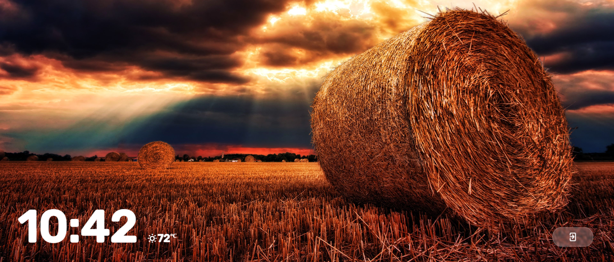

# TV App Menu With Lockscreen

**This repository is a web app that imitates the model of Google TV. It includes lockscreen feature that can be bypassed with a default 4-digit password.**

The default 4-digit password to bypass the locksScreen is "0000".

I developed this web app with Javascript, HTML and CSS. The interface is mobile responsive as well.

This project challenged my ability with data structures such as arrays, event bubbling and my knowledge of the Document Object Model. 

SCREENSHOTS
===================================

